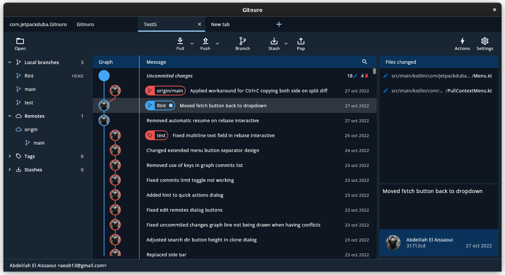

# Gitnuro - Multiplatform Git Client

[](https://github.com/JetpackDuba/Gitnuro/releases/latest)



A FOSS Git client based on (Jetbrains) Compose and JGit.

The main goal of Gitnuro is to provide a multiplatform open source Git client without any kind of constraint to how you
can use it nor relying on web technologies.

## Download/Install

Linux:

- Available as Flatpak [here](https://beta.flathub.org/apps/details/com.jetpackduba.Gitnuro) or by
  running `flatpak install --user com.jetpackduba.Gitnuro` if you have Flatpak & Flathub already setup.
- JAR file can be executed as a portable version (Requires JRE 17). SSH support requires installing [LibSSH](https://www.libssh.org/get-it/).

Windows:

- [Installable & portable version](https://github.com/JetpackDuba/Gitnuro/releases/latest).

MacOS:

- [ZIP which contains the app bundle](https://github.com/JetpackDuba/Gitnuro/releases/latest). SSH support requires installing LibSSH `brew install libssh`.
- Using hombrew: `brew install jetpackduba/apps/gitnuro`

## Features

Gitnuro has support for the following features:

- View diffs for text based files.
- View your history log and all its branches.
- Add (stage) & reset (unstage) files.
- Stage & unstage of hunks.
- Checkout files (revert changes of uncommited files).
- Clone.
- Commit.
- Reset commits.
- Revert commits.
- Amend previous commit.
- Merge.
- Rebase.
- Create and delete branches locally.
- Create and delete tags locally.
- View remote branches.
- Pull and push.
- Stash and pop stash.
- Checkout a commit (detached HEAD).
- View changes/diff in images (side to side comparison).
- Force push.
- Remove branches from remote.
- Manage remotes.
- Start a new local repository.
- Search by commit message/author/commit id.
- Rebase interactive.
- Blame file.
- View file history.
- Theming.
- Side by side diff in text files.
- Stage/Unstage specific lines.
- Submodules support.
- Change the tracking of a specific branch.

<details>
  <summary><b>Features planned</b></summary>

- Create/Apply patches
- Remove tags from remote.
- View stashes in the log tree.
- Syntax highlighting for diff.
- Various log options like showing the author, filtering by current branch o hide remote branches.
- Customizations settings.

</details>

## Contributing

If you find a bug or you would like to suggest a new feature, feel free to open an issue.

Pull requests are also welcome but please create an issue first if it's a new feature. If you want to work on an
existing issue, please comment so I'm aware of it and discuss the changes if required.
See [this page](DEVELOPMENT.md) for how to set up your development environment.

## FAQ

> Is Gitnuro completly free?

Yes, free in both meanings of the word (in money and freedom).

> Does Gitnuro keep track of my data?

Gitnuro does not track data in any way, don't worry.

> I don't like the built-in themes, can I create a custom one?

Gitnuro includes the option to set custom themes in a JSON format. Keep in mind that themes may break with new releases,
making the default theme the fallback option.

For the latest stable version (1.1.0), you can use this JSON as an example:

```
{
    "primary": "FF456b00",
    "primaryVariant": "FF456b00",
    "onPrimary": "FFFFFFFFF",
    "secondary": "FF9c27b0",
    "onBackground": "FF141f00",
    "onBackgroundSecondary": "FF595858",
    "error": "FFc93838",
    "onError": "FFFFFFFF",
    "background": "FFe7f2d3",
    "backgroundSelected": "C0cee1f2",
    "surface": "FFc5f078",
    "secondarySurface": "FFedeef2",
    "tertiarySurface": "FFF4F6FA",
    "addFile": "FF32A852",
    "deletedFile": "FFc93838",
    "modifiedFile": "FF0070D8",
    "conflictingFile": "FFFFB638",
    "dialogOverlay": "AA000000",
    "normalScrollbar": "FFCCCCCC",
    "hoverScrollbar": "FF0070D8",
    "diffLineAdded": "FF0070D8",
    "diffLineRemoved": "FF0070D8",
    "isLight": true
}
```

Colors are in ARGB Hex format.

> Why isn't the Mac version signed?

The cost of the Apple Developer Program is quite high with a platform that currently has very few users. I may pay for
it if it's a very requested feature but not for now.

> Authentication has failed. What's wrong?

Currently there are some limitations regarding this topic. Here are some known problematic setups:

- SSH keys managed by external agents (https://github.com/JetpackDuba/Gitnuro/issues/17).
- Configurations added to .ssh/config
- Non-default ssh dir path.
- Multicast DNS remote URL (https://github.com/JetpackDuba/Gitnuro/issues/19) with this
  workaround (https://github.com/JetpackDuba/Gitnuro/issues/19#issuecomment-1374431720).
- Self signed server certificate (https://github.com/JetpackDuba/Gitnuro/issues/48)

If the authentication fails and you think its due to a different reason, please open a new issue.


> Does it support Git credentials manager (aka manager-core)?
> Yes but it requires specifying the full path of the binary in your `.gitconfig`.

Example for linux:

```
[credential]
   helper = /usr/share/git-credential-manager-core/git-credential-manager-core
```

Example for windows (you may want to edit `C:\Program Files\mingw64\etc\gitconfig`):

```
[credential]
   helper = C:/Program Files/Git/mingw64/bin/git-credential-manager-core.exe
```
